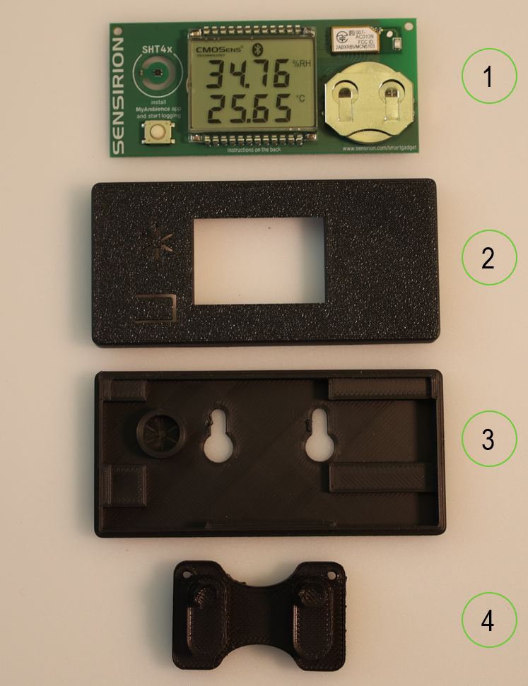

# SHT4x Smartgadget Housing

## Introduction

The SHT4x Smartgadget is a simple reference design circuit board which demonstrates the outstanding performance and ease of use of Sensirion’s SHT4x Humidity and Temperature sensors. It is equipped with a Liquid Crystal Display (LCD) showing humidity and temperature information. It also features a Bluetooth connection which can be used by smartphones. If you want to buy this gadget or find more information about this sensor, please go to our [Website](https://sensirion.com/products/catalog/SHT4x-Smart-Gadget/).

Since the sensor on the SHT4x Smartgadget is very exposed, a housing was created to better protect it. This guide will show you how to assemble the housing for the SHT4x Smartgadget in order to place it somewhere on your wall or on your desk. In addition, there follows a short sequence describing the influence of the case on the sensor's measurement and what to expect from the SHT4x Smartgadget in the housing. Thus, the guide is structured in these parts:

* [Hardware Setup](#hardware-setup)
    * [Step by Step Assembly](#step-by-step-assembly)
* [Mechanical Integration](#mechanical-integration)
* [Housing Influence on Sensor Reading](#housing-influence-on-sensor-reading)
    * [Introduction](#introduction)
    * [Accuracy](#accuracy)
    * [Response Time](#response-time)

## Hardware Setup

To complete this tutorial you will need:

* SHT4x Smart Gadget
* 3D printed housing of the gadget, consisting of 3 parts (Front, Back and Wall Mount). You can print all these parts yourself (STL files are in the folder "Housing")

### Step by Step Assembly

1. Have the SHT4x Smartgadget (1) ready for assembly and print the Front (2), Back (3) and Wall Mount (4) of the housing:

2. Fit the SHT4x Smartgadget into the back wall of the printed housing:

3. Close the housing with the front part:

4. In the end, the wall mount can be attached to the opening at the back and either be attached to the wall or simply used as a stand on your desk:

## Mechanical Integration

In order to design such a housing, different requirements need to be met. Firstly and foremost, the sensor readings should be affected minimally by the housing. To do this, the general guide for temperature sensors was followed. The full guide can be found on the [Sensirion Website](https://sensirion.com/media/documents/FC5BED84/61644655/Sensirion_Temperature_Sensors_Design_Guide_V1.pdf). In general, a few things need to be considered. Primarily, the sensor needs to have good access to the environment to allow for air exchange. In addition, the sensor should be sealed from the rest of the compartment to minimize the influence of trapped air inside the housing and only measure the ambient air flow, meaning it should also be decoupled from heat sources like e.g. a microcontroller or the power electronics.

As can be seen from the bare SHT4x Smartgadget Housing in this first picture, the sensor is perfectly decoupled from the rest. The cut-out around the sensor separates the sensor from the rest, hence, allowing for optimal air flow.

To ensure that this encapsulation still holds in the housing, a cylinder was implemented around the sensor. With this implementation, the sensor should only be affected by the ambient conditions. As it was not clear what design of the opening was better for the specifications from the beginning, two designs were made. One which is optically more pleasing with a flower pattern and another one with a hole to guarantee enough air flow to the sensor. Both designs can be seen in the photos below. Both designs were tested and compared to each other at a later stage to define the final case.

## Housing Influence on Sensor Reading

### Introduction

Having a housing around the sensor can influence the accuracy and response time. Thus, the following parts show why and how the sensor readings change due to the housing. Firstly, the accuracy of the sensor might change in a housing depending on how it is coupled to the ambient temperature and how the interaction is between the microcontroller, the power electronics and the sensor itself (especially regarding temperature). In addition, the response time of a sensor can greatly vary when having a case since the housing needs to adapt to the new environment as well and might not change as fast as the ambient conditions. As an example: When you open your window to ventilate your room, the housing around the sensor needs time to adapt to the new temperature and will thus influence the sensor reading as the housing will still have the temperature from before.

**Experimental Conditions**

To test the accuracy of the sensor inside the housing a bare SHT4x and a SHT4x Smartgadgets in the housing the flower opening were set into a temperature chamber at 20, 25 and 30°C where the humidity changed from 40 to 50 to 50% RH in 3h periods. From the sensor readings it could be gathered how good the accuracy is.

In order to test the response time, the temperature response time and the humidity response time were tested separately to exclude mutual influence. For this measurement a bare SHT4x, bare SHT4x Smartgadget, a SHT4x Smartgadget inside the housing with a hole and a SHT4x Smartgadget inside the housing with the flower opening were used. To obtain a temperature response, the temperature chamber was set at 10 °C below ambient while the humidity remained unchanged. After achieving a steady state measurement of the temperature chamber, all sensors were moved out of the chamber and into the ambient to see how quickly they would adjust. Similarly, for humidity, the temperature remained the same as in the ambient, but the humidity was set to 20% higher than in the room. Again, once a stable reading was reached, all sensors were taken out to see how quickly the humidity would adapt.

### Accuracy

The sensor accuracy of a bare SHT4x is $ \pm $ 0.2°C and $\pm$ 2% RH when following the specifications of the datasheet. Thus, looking at the measurement in the graph below, the SHT4x Smartgadget in its housing has the same accuracy as the bare sensor at different temperatures and humidity levels. It can be concluded that the design of the SHT4x Smartgadget does not affect the accuracy of the sensor. The sensor is well decoupled from the microcontroller, so it does not affect the sensor measurement and the housing does not create an additional temperature offset.

### Response Time

As can be seen from the plot above, the housing of the SHT4x Smartgadget has a large influence on the response time of the temperature. But even the bare SHT4x Smartgadget in comparison to the SHT sensor has a large response time difference although the bare SHT4x Smartgadget only has the PCB and a really good coupling of the sensor the the ambient conditions. Then again, when comparing the enclosure with a full hole and without it does not differ a lot. Thus, the full thermal mass of the housing has a much bigger influence on the sensor reading than having a bigger hole above the sensor to have a good ambient coupling.

The plot above shows that the opening of the enclosure has a larger influence on the humidity response time than on the temperature response time. Nevertheless, comparing the times between the temperature and humidity response time the temperature response is the bottleneck and is highly effected by the whole housing itself. Thus, when taking the example from above where you would open the window to ventilate your room and measure the new temperature and humidity, the temperature reading will be much slower and thus influence the humidity signal anyways. For this reason, we opted for the case with the nice opening, because all things considered, it doesn't make much of a difference.

### Conclusion

As shown in the previous sections, you now know what you should expect when using the SHT4x Smartgadget with its Housing compared to without it. The housing does not affect the accuracy of the sensor but introduces a longer response time. Thus, when the conditions change rapidly, the sensor will be slower in detecting this change due to the thermal mass of the whole housing. Hence, depending on how you want to utilize the SHT4x Smartgadget, you need to be aware of the drawbacks which come with the housing regarding the response time but nevertheless, the housing gives the sensor a better protection against the weather.
